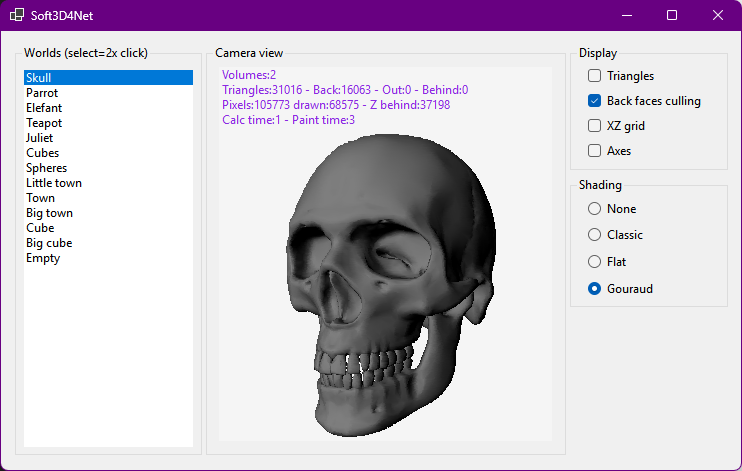
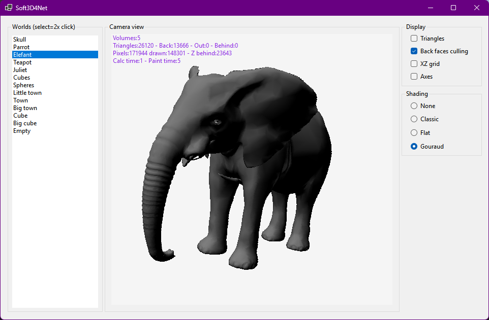
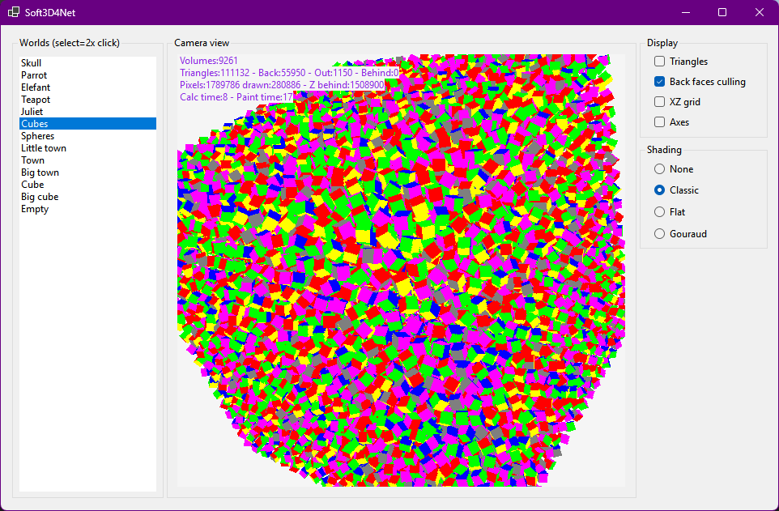

# Soft3D4Net  

This is a simple 3D software renderer that uses the CPU to render 3D graphics I did while learning, following https://www.davrous.com/category/3d-software-engine/
It is not optimized for performance, but it is a good starting point for learning about 3D graphics and rendering techniques.  

